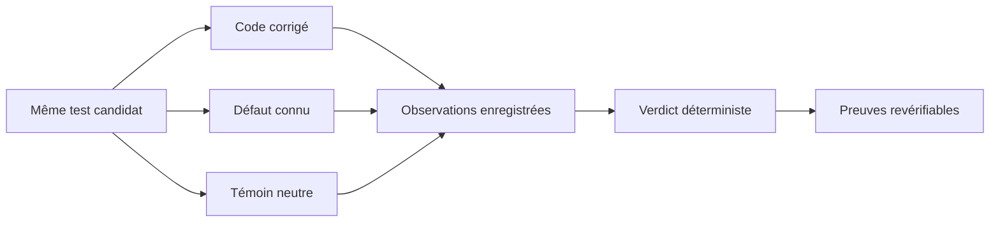

# AssertLedger

**Votre test de régression détecte-t-il vraiment le bug ?**

AssertLedger exécute le même test sur le code corrigé, un défaut connu et un témoin neutre.
Vous obtenez un verdict, les observations qui le justifient et un fichier de preuves à revérifier.

[English](README.md) · **Français**

[Essayer l’exemple](#essayer-lexemple) · [Comprendre le résultat](#comprendre-le-résultat) · [Utiliser votre dépôt](#utiliser-votre-dépôt) · [Documentation](#documentation)

**1.0 · node:test · CLI, SDK et MCP · MIT**

Installez l’outil dans votre dépôt avec Node.js 22.15 ou une version ultérieure :

```sh
npm install --save-dev assertledger@1.0.0
npx assertledger doctor .
```

La [démonstration d’une correction historique](examples/git-history/README.md) fonctionne depuis
le paquet installé. L’exemple source ci-dessous détaille les preuves étape par étape.

## Un test vert peut laisser passer le bug

La fonction `isEven(2)` doit renvoyer `true`. Une régression inverse accidentellement sa réponse.

```js
// Les deux tests passent avec le code correct.
assert.equal(typeof isEven(2), "boolean"); // Passe aussi quand la réponse est fausse.
assert.equal(isEven(2), true);             // Détecte cette régression précise.
```

AssertLedger rend cette différence visible :

| Même test candidat | Code corrigé | Défaut connu | Témoin neutre | Résultat |
| --- | --- | --- | --- | --- |
| « Renvoie un booléen » | Réussite | Réussite | Réussite | `WEAK_ORACLE` pour ce défaut |
| « Deux est pair » | Réussite | Échec d’assertion | Réussite | Admissible à la sélection |
| Le test plante ou dépasse le délai | — | Erreur d’exécution | — | Ne compte pas comme détection |

Vous fournissez le défaut et le témoin neutre. AssertLedger ne décide pas de leur signification.
Des exécutions répétées et des tests de contrôle vérifient que la différence observée peut être
attribuée au test candidat.



## Essayer l’exemple

Prérequis : **Git**, **Node.js 22.15+** et **pnpm 11.1.2**. Le premier adaptateur intégré utilise `node:test`.

```sh
git clone --branch v1.0.0 https://github.com/hoklims/assertledger.git
cd assertledger
pnpm install --frozen-lockfile
pnpm build
```

L’exemple fourni contient une fonction de parité correcte, sa version inversée, un témoin neutre
équivalent et les deux tests présentés plus haut. Consultez [sa requête](examples/node-test/request.json),
puis lancez :

```sh
node dist/cli.js verify examples/node-test/request.json --allow-unsafe-execution --json
```

> **Exécutez uniquement du code de confiance.** L’option `--allow-unsafe-execution` autorise
> l’exécution locale du code. Ce mode est explicitement **UNSANDBOXED**, sans bac à sable :
> il ne protège pas votre machine contre du code malveillant.

Décision attendue :

```json
{
  "status": "VERIFIED",
  "selectedCandidateIds": ["strong"],
  "reasonCodes": ["POLICY_SATISFIED"]
}
```

Il s’agit de la section `decision` du manifeste complet. Le candidat `weak` reçoit le motif
`WEAK_ORACLE`. Le manifeste consigne aussi les contrôles, les tentatives, les résultats observés,
les empreintes et les limites d’exécution.

### Enregistrer et revérifier les preuves

Créez un fichier `demo.mjs` à la racine du dépôt avec ce contenu. Il utilise le même exemple via
le SDK et écrit le manifeste en UTF-8, sous Windows comme sous Linux :

```js
import { readFile, writeFile } from "node:fs/promises";
import { AssertLedger } from "./dist/index.js";

const ledger = new AssertLedger();
const request = JSON.parse(await readFile("examples/node-test/request.json", "utf8"));
// Examinez l’exemple de confiance avant d’autoriser explicitement son exécution.
request.isolation.acknowledgedUnsafeExecution = true;
const manifest = await ledger.verify(request);
await writeFile("manifest.json", JSON.stringify(manifest, null, 2), "utf8");
console.log(manifest.decision);
```

```sh
node demo.mjs
node dist/cli.js replay manifest.json --json
```

Les cinq champs de vérification doivent valoir `true` : `valid`, `schemaValid`, `decisionDigestValid`,
`artifactDigestValid` et `decisionSemanticsValid`. Cette revérification ne nécessite aucun modèle
d’IA et ne relance pas les tests.

## Comprendre le résultat

| Verdict de la campagne | Ce qu’il indique | Suite à donner |
| --- | --- | --- |
| `VERIFIED` | Les tests sélectionnés respectent la politique déclarée pour ces variantes et ces tentatives. | Examinez le défaut, les contrôles et les preuves avant d’accepter le test. |
| `REJECTED` | Aucun candidat ne respecte la politique déclarée. | Consultez les motifs ; renforcez l’assertion ou corrigez les variantes déclarées. |
| `INCONCLUSIVE` | Les observations ne permettent pas de décider de façon stable. | Examinez les exécutions instables, la découverte des tests et les erreurs d’exécution. |
| `ENGINE_ERROR` | La campagne n’a pas produit de résultat exploitable. | Corrigez l’environnement ou la configuration, puis relancez. |

Un délai dépassé, une erreur de syntaxe, un échec de collecte des tests ou un plantage de processus
**ne compte jamais comme un bug détecté**. Un rejet concerne le défaut déclaré ; le test peut
rester utile dans d’autres situations.

La commande `replay` contrôle l’intégrité et la cohérence de la décision. Elle n’authentifie pas
l’auteur des observations, ne prouve pas la correction générale du programme et ne garantit pas
qu’un test restera toujours stable.

## Utiliser votre dépôt

Commencez par un diagnostic statique. Il lit le dépôt sans exécuter ses tests ni écrire de fichiers :

```sh
node dist/cli.js doctor path/to/your-repository
node dist/cli.js doctor path/to/your-repository --json
```

`WOULD_CREATE` signifie qu’une configuration peut être préparée. Vous fournissez encore le test
candidat et les contrôles. Le [guide d’initialisation](docs/repository-init.md) décrit `init`,
la configuration et le verrou des preuves. Détecter un framework ne signifie pas savoir l’exécuter.

Après l’initialisation, le [diagnostic dynamique](docs/runtime-doctor.md) vérifie Node, le reporter,
la découverte des tests et l’attribution des assertions avec `doctor --runtime --allow-unsafe-execution`.
Pour comprendre un refus, lancez `explain CODE` : la commande indique la prochaine action sûre.

### Qualifier un test de régression commité

Choisissez le commit qui contient le bug (`BEFORE`), sa correction (`AFTER`) et un témoin neutre
(`NEUTRAL`). Le candidat provient de `AFTER` ; ses octets restent identiques dans les trois variantes.
Remplacez les chemins, les révisions et la justification du témoin par vos propres valeurs :

```sh
node dist/cli.js check path/to/your-repository --before BEFORE --after AFTER --neutral NEUTRAL --neutral-reason "Expliquez pourquoi ce témoin préserve le comportement attendu" --test tests/regression.test.js --base-test tests/base.test.js --out .assertledger/evidence-001 --allow-unsafe-execution
```

| Prérequis de ce premier parcours Git | Pourquoi |
| --- | --- |
| Un candidat JavaScript `node:test` commité | Chaque variante reçoit le même test enregistré. |
| Aucune dépendance d’exécution déclarée | Ce parcours n’installe ni ne transporte les dépendances. |
| Un test de base inchangé dans chaque révision | Le contrôle ne doit pas varier avec la correction. |
| Les mêmes chemins de fichiers, hormis le candidat | Les ajouts, suppressions et renommages ne sont pas encore qualifiés. |

La commande enregistre `summary.md`, `executed-request.json` et `manifest.json` dans un nouveau dossier.
Le manifeste est publié en dernier ; sa présence marque un résultat complet. La requête enregistrée
pointe vers une copie temporaire supprimée après l’exécution ; conservez les révisions Git pour
relancer la campagne. Le [guide du parcours Git](docs/git-regression.md) détaille les limites et
le rôle du témoin neutre.

## Utiliser AssertLedger avec un agent

Un agent propose un test candidat ; le moteur déterministe évalue les observations.
Consultez le [skill pour les agents](integrations/skill/SKILL.md), le
[SDK TypeScript](docs/reference.md#typescript-sdk) ou la [référence MCP](docs/reference.md#mcp-v2-over-stdio).

Générez une configuration Codex propre au projet avec le CLI compilé :

```sh
node dist/cli.js connect path/to/your-repository --client codex
```

Cette commande prévisualise la configuration et le skill fourni. Ajoutez `--write` pour les
installer ; tout contenu existant différent est conservé et signalé comme un conflit.
Le serveur MCP généré démarre en lecture seule. L’exécution de tests candidats demande une
autorisation explicite distincte. Le [guide de prise en main](docs/developer-experience.md) précise
les exigences de confiance du projet et de rechargement du client.

Utilisez `--client claude-code` pour Claude Code ou `--client mcp` pour un descripteur générique.
`disconnect --client codex --write` retire seulement les fichiers restés strictement identiques.
Le [guide des clients](docs/client-connections.md) décrit l’installation et la désinstallation.

## Documentation

Le guide Git est en français ; les autres références techniques sont en anglais.

| Vous souhaitez… | Commencez ici |
| --- | --- |
| Préparer un dépôt | [Initialisation](docs/repository-init.md) · [Audit statique](docs/repository-audit.md) |
| Comprendre un blocage | [Diagnostic dynamique](docs/runtime-doctor.md) · [Explication des motifs](docs/diagnostics.md) |
| Essayer une correction historique | [Exemple Unicode-regexp](examples/git-history/README.md) |
| Qualifier une correction ou connecter Codex | [Parcours Git](docs/git-regression.md) · [Prise en main](docs/developer-experience.md) |
| Comprendre l’attribution, les contrôles et les empreintes | [Modèle de preuve](docs/proof-model.md) |
| Intégrer le CLI, le SDK ou MCP | [Référence d’intégration](docs/reference.md) |
| Vérifier le paquet réellement distribué | [Contrôles de distribution](docs/distribution.md) · [Preuves CI](docs/ci.md) |
| Développer un adaptateur | [Protocole des adaptateurs](docs/adapter-protocol.md) · [Architecture](docs/architecture.md) |
| Consulter le périmètre de la version 1.0 | [Critères de release](docs/release-1.0.md) · [Feuille de route](docs/roadmap.md) |
| Explorer les évaluations avancées | [Profils](docs/agentic-test-profile.md) · [Benchmarks](docs/agentic-benchmark.md) · [Calibration](docs/agentic-corpus-plan.md) |

Les profils scientifiques et la calibration conservent leurs propres exigences de preuve.
Leur présence n’établit ni un avantage sur un produit externe ni une adéquation au marché mesurée.

## Contribuer

```sh
pnpm check
pnpm run smoke:package
```

Ajoutez un test comportemental rouge avant de changer un contrat public. Gardez l’exécution
dans le moteur et les décisions dans le noyau pur. Consultez [CONTRIBUTING.md](CONTRIBUTING.md)
et [SECURITY.md](SECURITY.md).

**Compatibilité :** le nom actuel est AssertLedger. Les anciens alias TestForge et les identifiants
des contrats versionnés restent disponibles pour préserver les intégrations et la revérification
des preuves existantes. Consultez le [guide de migration](docs/migration-testforge-to-assertledger.md).

Distribué sous licence [MIT](LICENSE).
