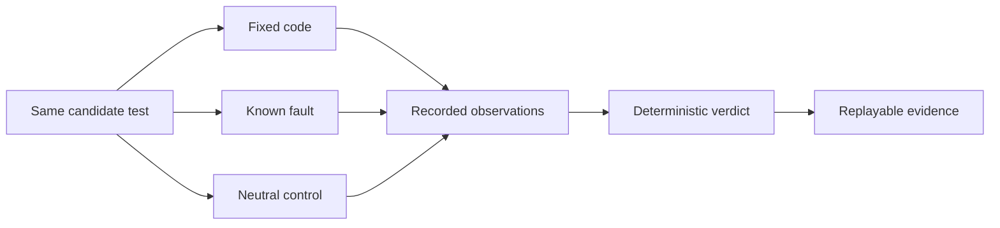

# AssertLedger

**Does your regression test actually catch the bug?**

AssertLedger runs the same test against fixed code, a known fault and a neutral control.
You get a verdict, the observations behind it and an evidence file you can replay.

**English** · [Français](README.fr.md)

[Try the example](#try-the-example) · [Understand the result](#understand-the-result) · [Use your repository](#use-your-repository) · [Documentation](#documentation)

**1.0 · node:test · CLI, SDK and MCP · MIT**

Install in your repository with Node.js 22.15 or later:

```sh
npm install --save-dev assertledger@1.0.0
npx assertledger doctor .
```

The [historical correction demo](examples/git-history/README.md) runs from the installed package.
The source example below walks through the evidence step by step.

## A passing test can miss the bug

Suppose `isEven(2)` should return `true`. A regression accidentally inverts the implementation.

```js
// Both tests pass on the correct implementation.
assert.equal(typeof isEven(2), "boolean"); // Also passes when the answer is wrong.
assert.equal(isEven(2), true);             // Detects this particular regression.
```

AssertLedger makes that distinction explicit:

| Same candidate test | Fixed code | Known fault | Neutral control | Result |
| --- | --- | --- | --- | --- |
| “Returns a boolean” | Pass | Pass | Pass | `WEAK_ORACLE` for this fault |
| “Two is even” | Pass | Assertion failure | Pass | Eligible for selection |
| Test crashes or times out | — | Operational error | — | No credited detection |

The operator supplies the fault and the neutral control. AssertLedger does not invent their meaning.
Repeated runs and base tests check that the observed difference can be attributed to the candidate.



## Try the example

You need **Git**, **Node.js 22.15+** and **pnpm 11.1.2**. The first built-in adapter is `node:test`.

```sh
git clone --branch v1.0.0 https://github.com/hoklims/assertledger.git
cd assertledger
pnpm install --frozen-lockfile
pnpm build
```

The bundled example contains a correct parity function, an inverted version, a neutral equivalent,
and the two tests above. Inspect [its request](examples/node-test/request.json), then run:

```sh
node dist/cli.js verify examples/node-test/request.json --allow-unsafe-execution --json
```

> **Run trusted code only.** `--allow-unsafe-execution` authorizes local code execution.
> This backend is explicitly **UNSANDBOXED**. Use a trusted checkout; it cannot contain hostile code.

Expected decision:

```json
{
  "status": "VERIFIED",
  "selectedCandidateIds": ["strong"],
  "reasonCodes": ["POLICY_SATISFIED"]
}
```

That is the `decision` section of the full manifest. The `weak` candidate is marked `WEAK_ORACLE`.
The manifest also records the controls, attempts, observed outcomes, digests and execution limits.

### Save and replay the evidence

Create `demo.mjs` at the repository root with the following content. This writes UTF-8 consistently
on Windows and Linux and uses the same example through the SDK:

```js
import { readFile, writeFile } from "node:fs/promises";
import { AssertLedger } from "./dist/index.js";

const ledger = new AssertLedger();
const request = JSON.parse(await readFile("examples/node-test/request.json", "utf8"));
// Review the trusted example before explicitly authorizing its execution.
request.isolation.acknowledgedUnsafeExecution = true;
const manifest = await ledger.verify(request);
await writeFile("manifest.json", JSON.stringify(manifest, null, 2), "utf8");
console.log(manifest.decision);
```

```sh
node demo.mjs
node dist/cli.js replay manifest.json --json
```

All five replay fields should be `true`: `valid`, `schemaValid`, `decisionDigestValid`,
`artifactDigestValid` and `decisionSemanticsValid`. Replay requires no model and does not run tests again.

## Understand the result

| Campaign verdict | What it tells you | Next step |
| --- | --- | --- |
| `VERIFIED` | Selected tests meet the declared policy for these worlds and attempts. | Review the fault, controls and evidence before accepting the test. |
| `REJECTED` | No candidate meets the declared policy. | Read candidate reasons; strengthen the assertion or correct the declared worlds. |
| `INCONCLUSIVE` | The observations do not support a stable decision. | Inspect unstable runs, discovery and operational errors. |
| `ENGINE_ERROR` | The campaign could not produce a usable result. | Fix the environment or configuration, then rerun. |

A timeout, syntax error, collection failure or process crash **never counts as a detected bug**.
A rejection concerns the declared fault model; the test may still have value elsewhere.

Replay checks integrity and decision consistency. It does **not** authenticate whoever produced the
observations, prove general program correctness or guarantee permanent freedom from flaky tests.

## Use your repository

Start with a static diagnostic. It reads the repository without running its tests or writing files:

```sh
node dist/cli.js doctor path/to/your-repository
node dist/cli.js doctor path/to/your-repository --json
```

`WOULD_CREATE` means a configuration can be planned. You still supply the candidate and controls.
The [initialization guide](docs/repository-init.md) explains `init`, the configuration and evidence
lock. Detection of a framework is not proof that AssertLedger can execute it.

After initialization, [runtime doctor](docs/runtime-doctor.md) can check Node, the reporter,
discovery and assertion attribution with `doctor --runtime --allow-unsafe-execution`.
For a refusal, use `explain CODE` to get a safe next action.

### Qualify a committed regression test

Choose the buggy commit (`BEFORE`), its correction (`AFTER`) and a neutral control (`NEUTRAL`).
The candidate comes from `AFTER`; the exact same bytes run in all three worlds.
Replace the paths, revisions and neutral reason below with your own:

```sh
node dist/cli.js check path/to/your-repository --before BEFORE --after AFTER --neutral NEUTRAL --neutral-reason "Explain why this control preserves the expected behavior" --test tests/regression.test.js --base-test tests/base.test.js --out .assertledger/evidence-001 --allow-unsafe-execution
```

| Required for this first Git workflow | Why |
| --- | --- |
| Committed JavaScript `node:test` candidate | Each world receives the same recorded test. |
| No declared runtime dependencies | This workflow does not install or transport dependencies. |
| An unchanged base test in every revision | The control must not change with the correction. |
| The same file paths, apart from the candidate | File additions, deletions and renames are not qualified yet. |

The command saves `summary.md`, `executed-request.json` and `manifest.json` in a new output directory.
`manifest.json` is published last; its presence marks a complete result. The saved request refers to
a temporary snapshot that has been removed; preserve the Git revisions if you need to run again.
Read the [Git workflow guide](docs/git-regression.md) for limits and neutral-control semantics.

## Use it with an agent

An agent can propose a candidate; the deterministic engine evaluates the observations.
Use the [agent skill](integrations/skill/SKILL.md), [TypeScript SDK](docs/reference.md#typescript-sdk)
or [MCP reference](docs/reference.md#mcp-v2-over-stdio).

Generate a project-scoped Codex configuration from the built CLI:

```sh
node dist/cli.js connect path/to/your-repository --client codex
```

This previews the configuration and packaged skill. Add `--write` to install both; different
existing content is preserved and reported as a conflict. The generated MCP server starts read-only.
Candidate execution requires a separate explicit opt-in. See [developer entry points](docs/developer-experience.md)
for project trust and reload requirements.

Use `--client claude-code` for Claude Code or `--client mcp` for a generic descriptor.
`disconnect --client codex --write` removes only byte-identical owned files.
The [client guide](docs/client-connections.md) covers installation and removal.

## Documentation

| You want to… | Start here |
| --- | --- |
| Set up a repository | [Initialization](docs/repository-init.md) · [Static audit](docs/repository-audit.md) |
| Diagnose a blockage | [Runtime doctor](docs/runtime-doctor.md) · [Reason-code guidance](docs/diagnostics.md) |
| Try a historical correction | [Unicode-regexp example](examples/git-history/README.md) |
| Qualify a correction or connect Codex | [Git workflow](docs/git-regression.md) · [Developer entry points](docs/developer-experience.md) |
| Understand attribution, controls and digests | [Proof model](docs/proof-model.md) |
| Integrate the CLI, SDK or MCP | [Integration reference](docs/reference.md) |
| Verify the actual distributed package | [Distribution checks](docs/distribution.md) · [CI evidence](docs/ci.md) |
| Extend an adapter | [Adapter protocol](docs/adapter-protocol.md) · [Architecture](docs/architecture.md) |
| Review the 1.0 scope | [Release criteria](docs/release-1.0.md) · [Roadmap](docs/roadmap.md) |
| Explore advanced evaluation work | [Profiles](docs/agentic-test-profile.md) · [Benchmarks](docs/agentic-benchmark.md) · [Calibration](docs/agentic-corpus-plan.md) |

Scientific profiles and calibration retain their own evidence requirements. Their presence does
not establish an improvement on an external product or a measured product-market fit.

## Contribute

```sh
pnpm check
pnpm run smoke:package
```

Add a failing behavioral test for public contract changes. Keep execution in the engine and decision
logic in the pure core. Read [CONTRIBUTING.md](CONTRIBUTING.md) and [SECURITY.md](SECURITY.md).

**Compatibility:** AssertLedger is the current name. Legacy TestForge aliases and versioned wire
identifiers remain available so existing integrations and evidence can be replayed.
See the [migration guide](docs/migration-testforge-to-assertledger.md).

Licensed under [MIT](LICENSE).
